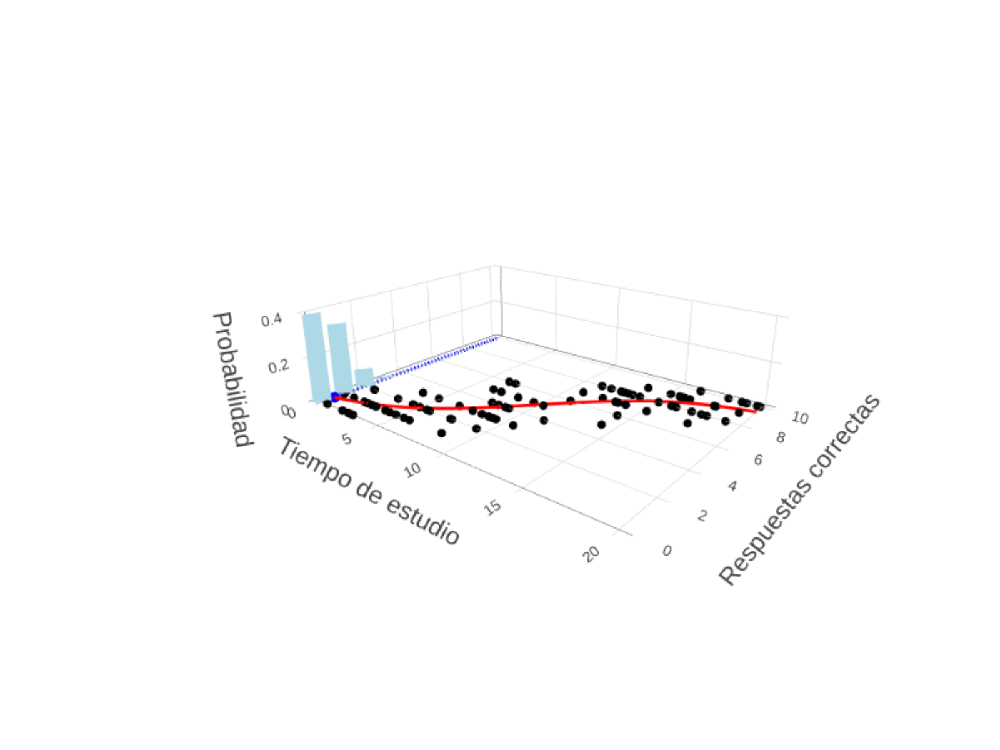

# Animación de Modelo GLM Binomial en 3D

Este repositorio contiene un script en R que genera una animación 3D usando `plotly` a partir de un modelo binomial ajustado, con la idea de reproducir los excelentes videos educativos sobre estadística en https://www.youtube.com/@Frans_Rodenburg
## 📊 Vista previa

## 📂 Estructura

- `glm binomial 3D (plot-ly).R`: script R que genera una secuencia de imágenes y produce un GIF animado.
- `animacion.gif`: resultado final de la animación.
- `frames/`: carpeta opcional con imágenes `.png` intermedias, si se incluyen.

## ▶️ Ejecutar

Para generar la animación:

1. Asegurate de tener instalados los paquetes `plotly`, `animation`, `magick` y otros requeridos.
2. plotly necesita una instalación funcional del paquete kaleido en python para guardar las imagenes como png.
3. Abrí el script:

   [`glm binomial 3D (plot-ly).R`](glm%20binomial%203D%20(plot-ly).R)

4. Ejecutalo desde RStudio o una consola de R.
5. Se generará un archivo `.gif` con la animación final.
